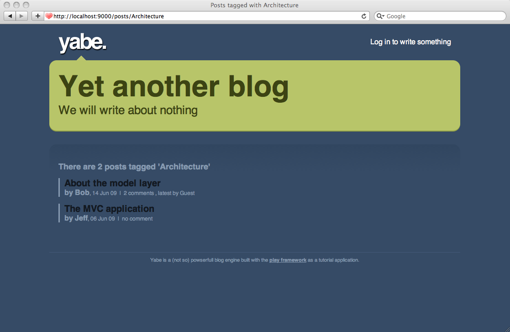

# 对添加标签的支持

随着博客的文章越来越多，找到要找的文章越来越难。如果能够添加标签，那就能更好地分类文章了。

## Tag模型

我们将给博客的模型们添加新成员。对`Tag`类的定义是非常简单的：

    package models;
     
    import java.util.*;
    import javax.persistence.*;
     
    import play.db.jpa.*;
     
    @Entity
    public class Tag extends Model implements Comparable<Tag> {
     
        public String name;
     
        private Tag(String name) {
            this.name = name;
        }
     
        public String toString() {
            return name;
        }
     
        public int compareTo(Tag otherTag) {
            return name.compareTo(otherTag.name);
        }
    }
    
因为有时想要在需要时才创建标签，我们写多一个`findOrCreateByName(String name)`工厂方法。把它加到`Tag`类：

    public static Tag findOrCreateByName(String name) {
        Tag tag = Tag.find("byName", name).first();
        if(tag == null) {
            tag = new Tag(name);
        }
        return tag;
    }

## 给文章打标签

现在是时候连接`Tag`和`Post`模型。让我们给`Post`类添加相应的关系：

    …
    @ManyToMany(cascade=CascadeType.PERSIST)
    public Set<Tag> tags;
     
    public Post(User author, String title, String content) {
        this.comments = new ArrayList<Comment>();
        this.tags = new TreeSet<Tag>();
        this.author = author;
        this.title = title;
        this.content = content;
        this.postedAt = new Date();
    }
    …
    
> 注意我们这里使用`TreeSet`来保持一个有序的标签列表。（由于我们之前的`compareTo`实现，按的是字母顺序）

我们将保持该关系为单向关系。

我们将给`Post`类添加一系列辅助函数。第一个用于给`Post`打标签：

    …
    @ManyToMany(cascade=CascadeType.PERSIST)
    public Set<Tag> tags;
     
    public Post(User author, String title, String content) {
        this.comments = new ArrayList<Comment>();
        this.tags = new TreeSet<Tag>();
        this.author = author;
        this.title = title;
        this.content = content;
        this.postedAt = new Date();
    }
    …
    
下一个是根据指定标签查找所有文章：

    …
    public static List<Post> findTaggedWith(String tag) {
        return Post.find(
            "select distinct p from Post p join p.tags as t where t.name = ?", tag
        ).fetch();
    }
    …

是时候写一个新的测试用例了。要在`test`模式下启动应用，输入：

    $ play test
    
添加新的`@Test`到`BasicTest`类：

    @Test
    public void testTags() {
        // Create a new user and save it
        User bob = new User("bob@gmail.com", "secret", "Bob").save();
     
        // Create a new post
        Post bobPost = new Post(bob, "My first post", "Hello world").save();
        Post anotherBobPost = new Post(bob, "Hop", "Hello world").save();
     
        // Well
        assertEquals(0, Post.findTaggedWith("Red").size());
     
        // Tag it now
        bobPost.tagItWith("Red").tagItWith("Blue").save();
        anotherBobPost.tagItWith("Red").tagItWith("Green").save();
     
        // Check
        assertEquals(2, Post.findTaggedWith("Red").size());
        assertEquals(1, Post.findTaggedWith("Blue").size());
        assertEquals(1, Post.findTaggedWith("Green").size());
    }
    
确保它能工作。

## 解决难题

如果你想要根据多个标签来查找相应的文章，该怎么办？这个问题比表面看上去要难。

我将直接给你所需的JPQL查询语句：

    …
    public static List<Post> findTaggedWith(String... tags) {
        return Post.find(
                "select distinct p from Post p join p.tags as t where t.name in (:tags) group by p.id, p.author, p.title, p.content,p.postedAt having count(t.id) = :size"
        ).bind("tags", tags).bind("size", tags.length).fetch();
    }
    …
    
代码的关键在于，我们需要使用一个`having count`语句来从连结产生的视图中过滤出拥有**全部**标签的文章。

> **注意**这里我们不能用`Post.find("...", tags, tags.count)`语法，因为`tags`是一个**变长参数**。

你可以在前一个测试中加入更多的检查来测试它：

    …
    assertEquals(1, Post.findTaggedWith("Red", "Blue").size());
    assertEquals(1, Post.findTaggedWith("Red", "Green").size());
    assertEquals(0, Post.findTaggedWith("Red", "Green", "Blue").size());
    assertEquals(0, Post.findTaggedWith("Green", "Blue").size());
    …
    
## 标签集合

我们最好有一个标签集合来看看有哪些标签。让我们给`Tag`类添加一个方法来生成标签集合：

    public static List<Map> getCloud() {
        List<Map> result = Tag.find(
            "select new map(t.name as tag, count(p.id) as pound) from Post p join p.tags as t group by t.name order by t.name"
        ).fetch();
        return result;
    }

这里，我们使用Hibernate的一个允许我们从JPA查询中返回自定义对象的特性。返回的结果是一个`Map`列表，其中每个`Map`包括标签名（键）和标签个数（值）。

在我们前面的测试中加多一个检查：

    …
    List<Map> cloud = Tag.getCloud();
    assertEquals(
        "[{tag=Blue, pound=1}, {tag=Green, pound=1}, {tag=Red, pound=2}]",
        cloud.toString()
    );
    
## 向博客界面添加标签

现在我们又多了一个浏览文章的方式了。为了保持高效，我们需要向初始数据集添加标签测试数据。

修改`/yabe/conf/initial-data.yml`来添加一些标签数据。比如：

    …
    Tag(play):
        name:           Play
     
    Tag(architecture):
        name:           Architecture
     
    Tag(test):
        name:           Test
     
    Tag(mvc):
        name:           MVC
    …

然后添加它们到文章的声明中：

    …
    Post(jeffPost):
        title:          The MVC application
        postedAt:       2009-06-06
        author:         jeff
        tags:
                        - play
                        - architecture
                        - mvc
        content:        >
                        A Play
    …
    
> 在YAML文件的顶部添加`Tags`的定义，因为它们会被`Post`用到。

你需要重启应用来加载新的初始数据。注意Play甚至会告诉你出现在YAML文件中的问题：

然后修改`#{display /}`标签，在全文模式下展示标签集合。修改`/yabe/app/views/tags/display.html`：

    …
    #{if _as != 'full'}
        
            &nbsp;|&nbsp; ${_post.comments.size() ?: 'no'}
            comment${_post.comments.size().pluralize()}
            #{if _post.comments}
                , latest by ${_post.comments[0].author}
            #{/if}
        
    #{/if}
    #{elseif _post.tags}
        
            - Tagged
            #{list items:_post.tags, as:'tag'}
                <a href="#">${tag}</a>${tag_isLast ? '' : ', '}
            #{/list}
        
    #{/elseif}
    …
    

## 标签页面

现在我们可以实现通过标签浏览文章了。在`#{display /}`标签，之前，我们留下一个空链接；现在终于可以用`listTagged` action补完它(修改`yabe/app/views/tags/display.html`)：

    …
    - Tagged
    #{list items:post.tags, as:'tag'}
        <a href="@{Application.listTagged(tag.name)}">${tag}</a>${tag_isLast ? '' : ', '}
    #{/list}
    …

在`Application`控制器创建action方法：

    …
    public static void listTagged(String tag) {
        List<Post> posts = Post.findTaggedWith(tag);
        render(tag, posts);
    }
    …
    
如常，我们创建一个特定的路由来保持URI语义化：

    GET     /posts/{tag}                    Application.listTagged
    
我们遇到一个问题，因为这个路由跟之前的冲突了。这两个路由将匹配同一个URI：

    GET     /posts/{id}                     Application.show
    GET     /posts/{tag}                    Application.listTagged
    
不过，因为我们假设一个`id`是数值类型，而`tag`不是，我们可以简单粗暴地用正则表达式解决问题：

    GET     /posts/{<[0-9]+>id}             Application.show
    GET     /posts/{tag}                    Application.listTagged
    
最后，我们需要创建`/yabe/app/views/Application/listTagged.html`模板，用于新的`listTagged` action：

    #{extends 'main.html' /}
    #{set title:'Posts tagged with ' + tag /}
     
    *{********* Title ********* }*
     
    #{if posts.size() > 1}
       <h3>There are ${posts.size()} posts tagged '${tag}'</h3>
    #{/if}
    #{elseif posts}
        <h3>There is 1 post tagged '${tag}'</h3>
    #{/elseif}
    #{else}
        <h3>No post tagged '${tag}'</h3>
    #{/else}
     
    *{********* Posts list *********}*
     
    

        #{list items:posts, as:'post'}
            #{display post:post, as:'teaser' /}
        #{/list}
    

    

