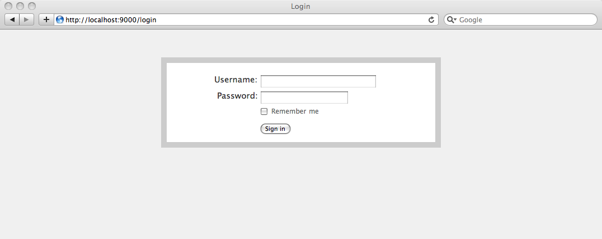
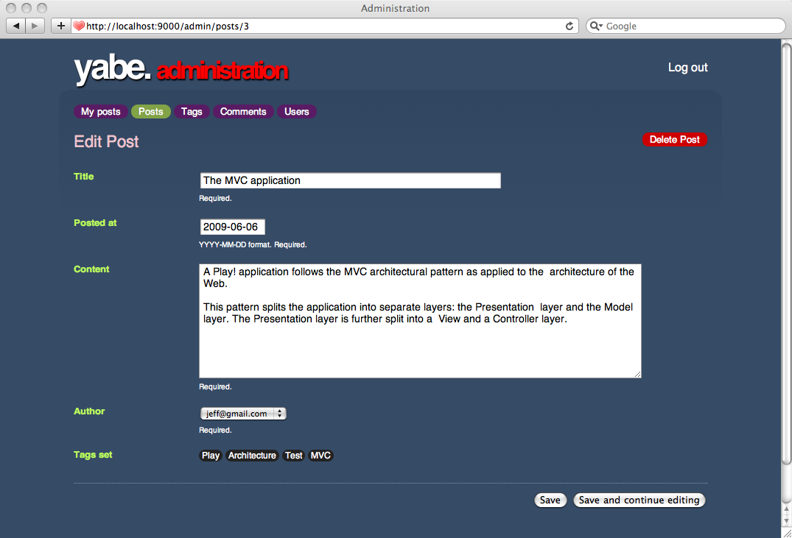
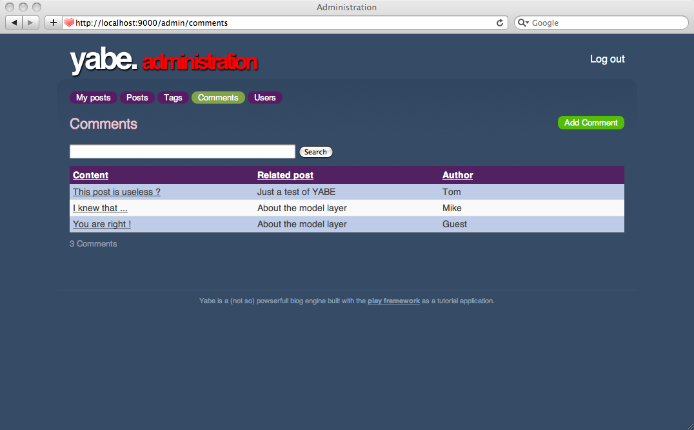
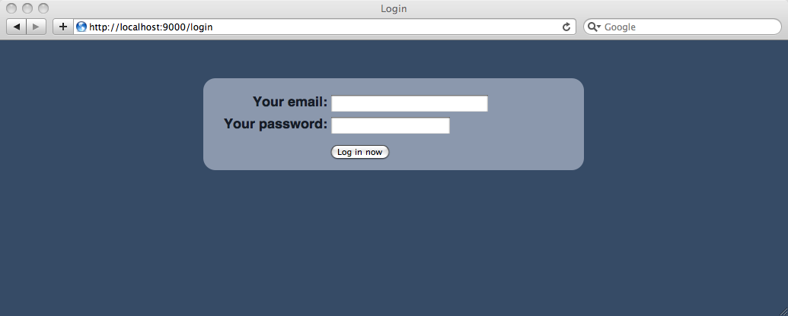

# 添加验证

既然我们有一个管理面板，自然需要进行验证。幸运的是，Play已经提供了一个叫做**Secure**的模块来帮助我们。

## 启动Secure模块

在`yabe/conf/application.conf`启动**Secure**模块，然后重启应用。

	# 导入secure模块
	module.secure=${play.path}/modules/secure
	
在重启后，Play应该提示说模块已被加载。

**Secure**模块提供一系列默认的路由。要导入这些路由，在`/yabe/conf/routes`加入：

	# Import Secure routes
	*      /              module:secrue
	
## 保护管理控制器

这个模块提供了一个`controllers.Secure`控制器，它定义了所有所需的拦截器。当然我们可以继承这个控制器，但是Java只支持单继承，可能不可以这么做。

除了直接继承`Secure`控制器，我们也可以给控制器加`@With`注解来告诉Play启动对应的拦截器：

	package controllers;
	 
	import play.*;
	import play.mvc.*;
	 
	@With(Secure.class)
	public class Posts extends CRUD {    
	}
	
同样处理`Comments`，`Users`和`Tags`控制器。

现在如果你想访问管理面板，就会跳转到登录页面。

不过，现在无论你往用户/密码框填什么，都会让你通过。

## 自定义验证过程

你可以用应用提供的`controllers.Secure.Security`实例来自定义验证过程。通过继承自该类，我们可以指定验证用户的方式。

创建`yabe/app/controllers/Security.java`，并重载`authenticata()`方法：

    package controllers;
     
    import models.*;
     
    public class Security extends Secure.Security {
	
        static boolean authenticate(String username, String password) {
            return true;
        }
        
    }
    
因为我们已经在模型层实现了User对象，验证方法的实现就很简单了：

    static boolean authenticate(String username, String password) {
        return User.connect(username, password) != null;
    }
    
现在前往<http://localhost:9000/logout>登出，然后尝试以`initial-data.yml`中的任意用户登入，比如`bob@gmail.com/secret`。

## 重构管理面板

我们通过CRUD模块开启了管理面板，但它跟博客的UI格格不入。所以我们还需要实现另一个管理面板。这个将给每个作者发布自己的文章的权限。当然，原来的管理面板还是可以留下来给超级管理员用。

让我们创建一个`Admin`控制器：

    package controllers;
     
    import play.*;
    import play.mvc.*;
     
    import java.util.*;
     
    import models.*;
     
    @With(Secure.class)
    public class Admin extends Controller {
        
        @Before
        static void setConnectedUser() {
            if(Security.isConnected()) {
                User user = User.find("byEmail", Security.connected()).first();
                renderArgs.put("user", user.fullname);
            }
        }
     
        public static void index() {
            render();
        }
        
    }
    
然后重构`yabe/conf/routes`里面的路由：

    # Administration
    GET     /admin/?                                Admin.index
    *       /admin                                  module:crud
    
记住路由文件中的顺序是有确切含义的；排在前面的会比后面的优先匹配。所以`Admin`的路由要放在映射到CRUD模块的路由的前面。否则，`/admin/`会被映射到`CRUD.index`而不是`Admin.index`。

现在在`yabe/app/views/main.html`添加到控制器的链接：

    …
    <ul id="tools">
        <li>
            <a href="@{Admin.index()}">Log in to write something</a>
        </li>
    </ul>
    …
    
接下来是创建`yabe/app/views/Admin/index.html`模板。让我们先从基础开始：

    Welcome ${user}!
    
现在，前往博客主页，点击“Log in to write something”链接，你应该到达新的管理面板：

好的开始！但因为管理面板将会有一系列新的页面，我们需要定义一个父模板。创建`yabe/app/views/admin.html`：

    <!DOCTYPE html>
    <html>
        <head>
            <title>Administration</title>		
            <meta http-equiv="Content-Type" content="text/html; charset=utf-8"/>
            #{get 'moreStyles' /}	
            <link rel="stylesheet" type="text/css" media="screen" 
                    href="@{'/public/stylesheets/main.css'}" />
            <link rel="shortcut icon" type="image/png" 
                    href="@{'/public/images/favicon.png'}" />
            
            
        </head>
        <body id="admin">
            
            

                

                    yabe. administration
                

                <ul id="tools">
                    <li>
                        <a href="@{Secure.logout()}">Log out</a>
                    </li>
                </ul>
            

            
            

                #{doLayout /} 
            

            
            

                Yabe is a (not so) powerful blog engine built with the 
                <a href="http://www.playframework.org">Play framework</a>
                as a tutorial application.
            

            
        </body>
    </html>
    
如你所见，它像是前面用在博客引擎上的模板。这里替换了**Log in**链接成**Log out**，调用secure模块提供的`Secure`控制器的`logout` action。

现在就把它用到`yabe/app/views/Admin/index.html`模板：

    #{extends 'admin.html' /}
     
    Welcome ${user}!
    
刷新！

尝试下**log out**，它会让你重新登录：

我们是用secure模块的默认方法来处理登出。不过自定义也是十分简单的，重载`controllers.Security`类中的`onDisconnected()`方法即可：

static void onDisconnected() {
    Application.index();
}

你可以同样重载`onAuthenticated()`：

    static void onAuthenticated() {
        Admin.index();
    }

## 添加身份

我们有两个管理面板：一个用于编辑者，另一个用于管理员。如你曾见，`User`模型有一个`isAdmin`成员，表示一个用户是否有管理员权限。

secure模块没有提供`authentication`，当然也没提供`authentization`。不过它提供了`profiles`。要创建`admin`身份（profile），你仅需重载`controllers.Security`中的`check()`。

    static boolean check(String profile) {
        if("admin".equals(profile)) {
            return User.find("byEmail", connected()).<User>first().isAdmin;
        }
        return false;
    }
    
如果用户具有管理员权限，我们可以提供一个管理员菜单。更新`app/views/admin.html`来添加顶级菜单：

    …
    

        
        <ul id="adminMenu">
            <li class="${request.controller == 'Admin' ? 'selected' : ''}">
                <a href="@{Admin.index()}">My posts</a>
            </li>
            #{secure.check 'admin'}
                <li class="${request.controller == 'Posts' ? 'selected' : ''}">
                    <a href="@{Posts.list()}">Posts</a>
                </li>
                <li class="${request.controller == 'Tags' ? 'selected' : ''}">
                    <a href="@{Tags.list()}">Tags</a>
                </li>
                <li class="${request.controller == 'Comments' ? 'selected' : ''}">
                    <a href="@{Comments.list()}">Comments</a>
                </li>
                <li class="${request.controller == 'Users' ? 'selected' : ''}">
                    <a href="@{Users.list()}">Users</a>
                </li>
            #{/secure.check}
        </ul>
        
        #{doLayout /} 
    

    …
    
注意我们用`#{secure.check /}`标签，只给`admin`用户展示菜单。

但是我们的CRUD部分依然处于危险之中！如果用户知道URL，他/她还是可以访问它。我们必须保护这些控制器。使用`@Check`注解是最简单的方法。举个例子，对于`Posts`控制器：

    package controllers;
     
    import play.*;
    import play.mvc.*;
     
    @Check("admin")
    @With(Secure.class)
    public class Posts extends CRUD {    
    }
    
同样处理`Tags`，`Comments`和`Users`控制器。现在作为普通用户（比如``）登录。你应该看不到CRUD管理员链接。如果试图访问<http://localhost:9000/admin/users>，你会得到一个**403 Forbidden**响应。

## 自定义CRUD布局

当我们使用基于CRUD的那个管理面板时，就无法使用管理布局了。因为CRUD模块提供了自己的布局。不过当然我们可以重载掉它。使用Play命令：

    play crud:ov --layout

你会得到一个`/yabe/app/views/CRUD/layout.html`。来把它的内容替换掉，集成我们的`admin.html`布局：

    #{extends 'admin.html' /}
    #{set 'moreStyles'}
        <link rel="stylesheet" type="text/css" media="screen" 
            href="@{'/public/stylesheets/crud.css'}" />
    #{/set}
     
    

     
        #{if flash.success}
        	

        		${flash.success}
        	

        #{/if}
        #{if flash.error || error}
        	

        		${error ?: flash.error}
        	

        #{/if}
     
        

        	#{doLayout /}
        

     
    

如你所见，我们重用了`crud.css`并使用**get/set**模板变量机制来融合`admin.html`。现在看下CRUD模块的管理面板，它应该跟管理布局结合在一起了：

## 美化登录界面

管理面板的界面大体上已经完成了。最后要做的，是美化登录界面。如常，从自定义默认的css开始吧。

    play secure:ov --css
    
要想维持原来的css，我们需要在顶部导入`main.css`。在`yabe/public/stylesheets/secure.css`顶部添加这一行：

    @import url(main.css);
    …

加入这些到你的`yabe/conf/messages`文件来自定义登录界面信息：

    secure.username=Your email:
    secure.password=Your password:
    secure.signin=Log in now
    

第八篇 - 完
