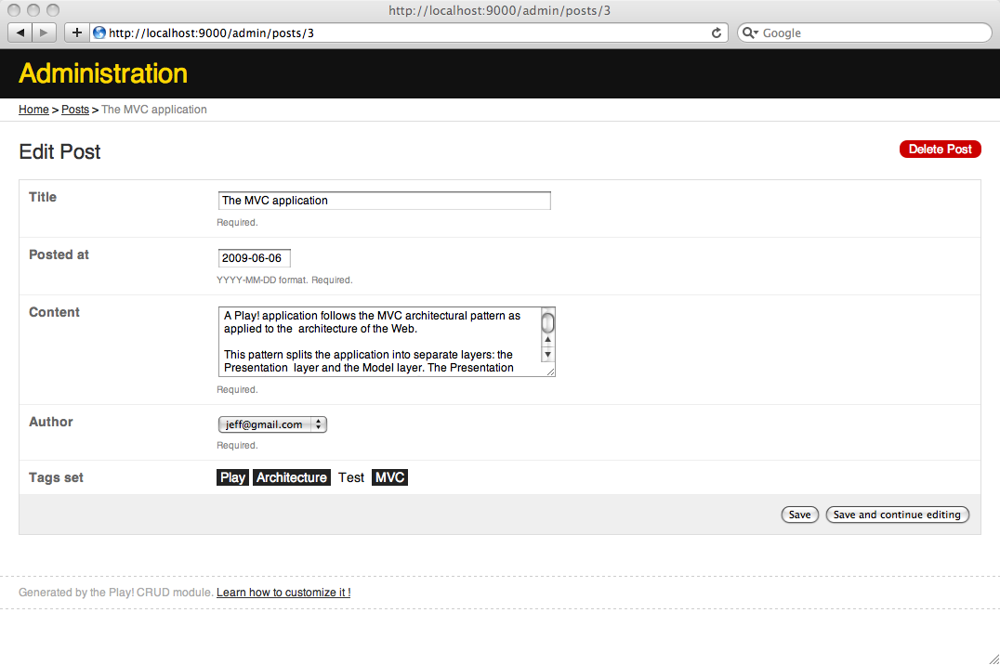

# 通过CRUD来实现一个基本的管理面板

目前，我们还没法使用博客的UI来写新的文章，或修改评论。Play提供了一个即开即用的**CRUD**模块，可以快速生成一个基本的管理面板。

## 启动CRUD模块

一个Play应用可以由几个模块组装起来。这使得你可以在不同应用间重用组件或分割一个大应用到几个小的。

CRUD模块是一个通用的应用，可以对模型类进行内省生成简单的列表和表单。

要启动CRUD模块，在`/conf/dependencies.yml`的`require`后面添加一行：

	require:
		- play -> crud
		
现在运行`play dependencies`命令，来解决新的模块依赖关系。如果正用着IDE，你应该更新项目配置，来包括新的模块依赖：比如，运行`play eclipsify`，然后在Eclipse里刷新项目。

然后这个模块提供一系列现在就能用上的**路由**。要导入这些路由，在`/yabe/conf/routes`加入：

	# Import CRUD routes
	*      /admin              module:crud
	
这将导入所有的CRUD路由，并以`/admin`作为URL前缀。

你需要重启应用来使得新模块的导入生效。

## 声明CRUD控制器

对于每个想集成到管理面板的模型，我们得声明一个继承自`controllers.CRUD`的控制器。这很简单。

给每个模型创建各创建一个控制器。比如，对于`Post`类，在`/yabe/app/controllers/Posts.java`创建一个`Posts`控制器。

	package controllers;
	 
	import play.*;
	import play.mvc.*;
	 
	public class Posts extends CRUD {    
	}
	
> 默认控制器的命名，是其对应的模型的复数。这样，Play就能自动搭配每个控制器和对应的模型。如果你需要指定特别的名字，你可以使用`@CRUD.For`注解。阅读[CRUD](http://www.playframework.com/documentation/1.2.7/crud)文档。

同样创建其他的控制器：

	package controllers;
	 
	import play.*;
	import play.mvc.*;
	 
	public class Users extends CRUD {    
	}
	package controllers;
	 
	import play.*;
	import play.mvc.*;
	 
	public class Comments extends CRUD {    
	}
	package controllers;
	 
	import play.*;
	import play.mvc.*;
	 
	public class Tags extends CRUD {    
	}
	
现在打开<http://localhost:9000/admin/>，你应该看到管理面板。

如果仔细看，你将注意到列表中对象的名字有点奇怪。这是因为默认是以`toString()`的输出来得到一个模型对象的表示。

所以，通过提供定制的`toString()`，我们就能解决这个问题。举个例子，对于User类：

	…
	public String toString() {
		return email;
	}
	…
	
## 添加验证

通常使用管理面板的问题是，提交的表单没有经过恰当的验证。但因为CRUD模块可以从验证注解提取出验证规则，所以如果模型类得到正确注解，就不会有问题。

让我们给`User`类添加一些注解。

	package models;
	 
	import java.util.*;
	import javax.persistence.*;
	 
	import play.db.jpa.*;
	import play.data.validation.*;
	 
	@Entity
	public class User extends Model {
	 
		@Email
		@Required
		public String email;
		
		@Required
		public String password;
		
		public String fullname;
		public boolean isAdmin;
	…
	
现在如果你来到`User`模型的编辑或创建表单，你将看到验证规则已经魔法般添加进去了。

接下来是`Post`类：

	package models;
	 
	import java.util.*;
	import javax.persistence.*;
	 
	import play.db.jpa.*;
	import play.data.validation.*;
	 
	@Entity
	public class Post extends Model {
	 
		@Required
		public String title;
		
		@Required
		public Date postedAt;
		
		@Lob
		@Required
		@MaxSize(10000)
		public String content;
		
		@Required
		@ManyToOne
		public User author;
		
		@OneToMany(mappedBy="post", cascade=CascadeType.ALL)
		public List<Comment> comments;
		
		@ManyToMany(cascade=CascadeType.PERSIST)
		public Set<Tag> tags;
	…

然后检查结果：

这里你会看到一个有趣的副作用：`@MaxSize`验证规则改变了Play显示Post表单的方式。现在它给内容域准备的是textarea。

最后是给`Comment`和`Tag`类添加验证规则。

	package models;
	 
	import java.util.*;
	import javax.persistence.*;
	 
	import play.db.jpa.*;
	import play.data.validation.*;
	 
	@Entity
	public class Tag extends Model implements Comparable<Tag> {
	 
		@Required
		public String name;
	…
	package models;
	 
	import java.util.*;
	import javax.persistence.*;
	 
	import play.db.jpa.*;
	import play.data.validation.*;
	 
	@Entity
	public class Comment extends Model {
	 
		@Required
		public String author;
		
		@Required
		public Date postedAt;
		 
		@Lob
		@Required
		@MaxSize(10000)
		public String content;
		
		@ManyToOne
		@Required
		public Post post; 
	…

如你所见，表单标签有点奇怪。Play使用Java成员变量作为表单标签。要想自定义它，我们仅需在`/yabe/conf/messages`中提供一组标签名。

> 事实上，你可以用一个单独的`messages`文件对应应用支持的每种语言。比如，你可以把中文信息放入`/yabe/conf/messages.zh`。你将会在最后一章读到如何进行本地化。

添加这些标签到`messages`文件：

    title=Title
    content=Content
    postedAt=Posted at
    author=Author
    post=Related post
    tags=Tags set
    name=Common name
    email=Email
    password=Password
    fullname=Full name
    isAdmin=User is admin
    
然后刷新表单，你将看到新的表单标签：

## 自定义Comments列表

你可以随心所欲地自定义CRUD模块。举个例子，你不大可能觉得评论列表长得符合你的期望。我们还需要添加更多列，特别是“相关文章”列来帮助我们过滤评论。

事实上，由于你的应用才是老大，你可以覆盖掉CRUD模块提供的任意**action**和**模板**。举个例子，如果我们想自定义评论列表，我们仅需提供`/yabe/app/views/Comments/list.html`模板。

在CRUD模块启动后，你就能使用更多的play命令。`crud:ov`命令帮助你覆盖掉任意模板。在命令行里。输入：

    $ play crud:ov --template Comments/list
    
现在你有一个新的模板`/yabe/app/views/Comments/list.html`：

    #{extends 'CRUD/layout.html' /}
     
    

	
	    <h2 id="crudListTitle">&{'crud.list.title', type.name}</h2>
     
	    

		    #{crud.search /}
	    

     
	    

		    #{crud.table /}
	    

     	
	    

		    #{crud.pagination /}
	    

	
	    

		    <a href="@{blank()}">&{'crud.add', type.modelName}</a>
	    

     
    

    
首先看看`&{'crud.list.title', type.name}`，这里输出了键名为`crud.list.title`的本地化信息，使用`type.name`作为信息参数。CRUD模块的`conf/messages`包括条目`crud.list.title=&{%s}`，其中的参数作为另一个参数查找时的键，比如这里的`&{'Comments'}`，因为`type`是一个`models.Comments`对应的`CRUD.ObjectType`。既然我们没有定义对应的信息文件条目，默认会输出信息键 - `Comments`。在本教程的最后一章，你会学到关于本地化信息的更多东西。

`#{crud.table /}`是生成表格的标签。我们可以使用`fields`参数添加更多列。试一下这个：

    #{crud.table fields:['content', 'post', 'author'] /}
    
现在我们有三列信息了：

有个问题，`content`域可能容不下有些过长的评论。我们需要指定`#{crud.table /}`能够在需要的时候截短它。

使用`#{crud.custom /}`标签，我们可以自定义每个域的展示方式：

    #{crud.table fields:['content', 'post', 'author']}
     #{crud.custom 'content'}
      <a href="@{Comments.show(object.id)}">
       ${object.content.length() > 50 ? object.content[0..50] + '…' : object.content}
      </a>
     #{/crud.custom}
    #{/crud.table}
    
> 是的，这里撒了些Groovy的语法糖。

## 自定义Posts表单

我们也可以自定义生成的表单。举个例子，原本我们在Post表单中输入标签并不容易。我们需要改善体验。让我们来重载掉`Posts/show`模板：

    $ play crud:ov --template Posts/show
    
现在你有了`/yabe/app/views/Posts/show.html`：

    #{extends 'CRUD/layout.html' /}
     
    

	
    <h2 id="crudShowTitle">&{'crud.show.title', type.modelName}</h2>
     
    

    #{form action:@save(object.id), enctype:'multipart/form-data'}
        #{crud.form /}
        

            <input type="submit" name="_save" 
                   value="&{'crud.save', type.modelName}" />
            <input type="submit" name="_saveAndContinue" 
                   value="&{'crud.saveAndContinue', type.modelName}" />
        

    #{/form}
    

     
    #{form @delete(object.id)}
        

            <input type="submit" value="&{'crud.delete', type.modelName}" />
        

    #{/form}
     
    

    
你可以通过给`#{crud.form /}`标签添加一个`crud.custom`标签来自定义`tags`域：

    #{crud.form}
        #{crud.custom 'tags'}
            <label for="tags">
                &{'tags'}
            </label>
           	    
	        

	            #{list items:models.Tag.findAll(), as:'tag'}
	               
	                   ${tag}
	                
	               <input id="h${tag.id}" type="hidden" name="${fieldName}" 
	                        value="${object.tags.contains(tag) ? tag.id : ''}" />
	            #{/list}
	        

        #{/crud.custom}
    #{/crud.form}
    
通过使用Javascript，我们实现了一个简单的标签选择器：

    

要想自定义标签列表的外观，以下面的内容创建`public/stylesheets/tags.css`：

    .tags-list .tag {
         cursor: pointer;
         padding: 1px 4px;
    }
    .crudField .tags-list .selected {
         background: #222;
         color: #fff;
    }
    
然后，在`views/CRUD/layout.html`，改变`#{set 'moreStyles'}`块成这样：

    #{set 'moreStyles'}
        <link rel="stylesheet" type="text/css" media="screen" href="@{'/public/stylesheets/crud.css'}" />
        <link rel="stylesheet" type="text/css" media="screen" href="@{'/public/stylesheets/tags.css'}" />
    #{/set}
    
管理面板的工作暂告一段落。
