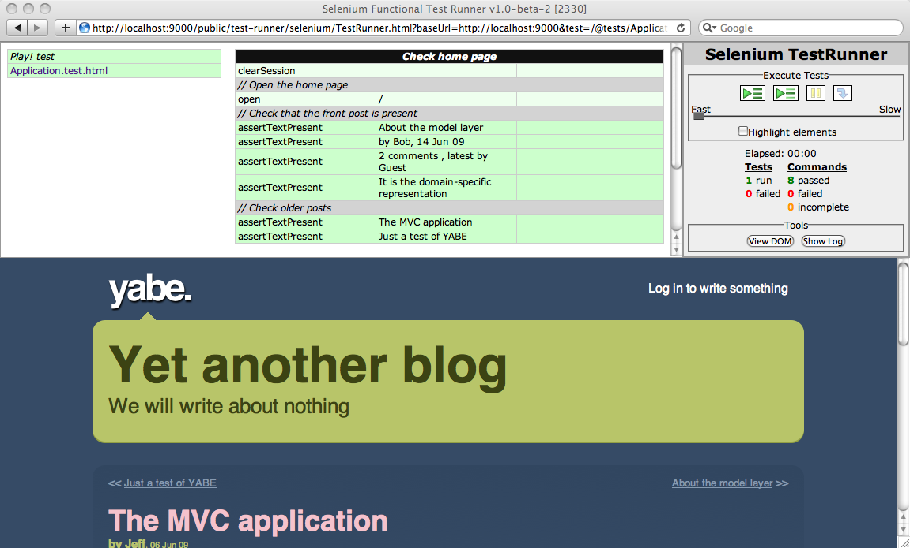
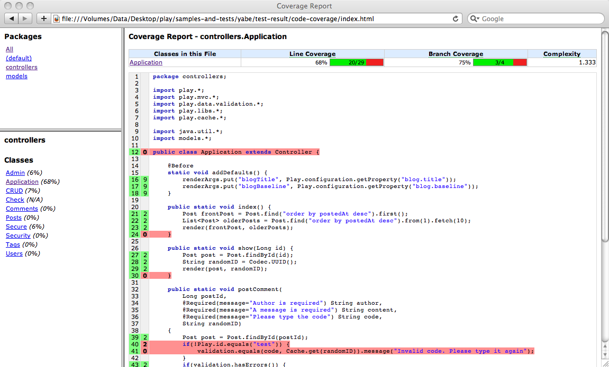

# 完成应用测试

我们已经完成了我们想要创建的博客引擎。不过这个项目尚未完全结束。为了保证代码的质量，我们需要添加更多的测试。

当然我们已经完成了测试所有模型层的功能。所以博客引擎的核心功能已经被测试过了。但是一个Web应用并不只有模型层。我们需要确保Web交互界面是否完好。这需要测试引擎的控制层。但是我们甚至需要测试UI界面，比如我们的Javascript代码。

## 测试控制层

通过JUnit，你可以直接测试应用的控制层。我们将这些测试称之为功能测试。因为我们会测试应用完整的功能。

一个功能测试会调用Play的`ActionInvoker`，模拟一个HTTP请求。我们需要提供HTTP方法，一个URI和HTTP参数。Play会根据这个请求，找到路由，接着调用对应的action，最后返回一个响应。你可以分析它，看看响应是否在意料之中。

先写第一个功能测试。打开`yabe/test/ApplicationTest.java`：

    import org.junit.*;
    import play.test.*;
    import play.mvc.*;
    import play.mvc.Http.*;
    import models.*;
     
    public class ApplicationTest extends FunctionalTest {
     
        @Test
        public void testThatIndexPageWorks() {
            Response response = GET("/");
            assertIsOk(response);
            assertContentType("text/html", response);
            assertCharset("utf-8", response);
        }
        
    }
    
看上去像是一般的JUnit测试。注意我们使用Play的`Functionaltest`父类来获取辅助函数。这个测试仅仅是用于检测主页是否正常（一般`/`URL会渲染一个HTML文件，并返回‘**200 OK**’状态码）。

现在我们将检测管理面板的安全是否禁得住考验。给`ApplicationTest.java`添加新的测试：

    …
    @Test
    public void testAdminSecurity() {
        Response response = GET("/admin");
        assertStatus(302, response);
        assertHeaderEquals("Location", "/login", response);
    }
    …
    
使用`play test`命令运行你的yabe应用，打开<http://localhost:9000/@tests>，选择`ApplicationTest.java`用例，然后运行它。

变绿了吗？

现在，我们可以对应用的全部功能进行同样的测试，但这并不是测试一个基于HTML的Web应用的最佳方式，我们的博客引擎需要在Web浏览器中执行，如果能够在**真实的浏览器**中进行测试，这就是Play的**Selenium测试**所做的事情。

一个Selenium测试套件一般是个HTML文件。Selenium所使用的HTML语法有点令人乏味（就像是一个HTML表格元素一样）。好消息是，Play可以让你使用模板引擎以及一些支持简化的Selenium语法的标签来生成它。这也意味着，你可以利用Play模板的表达能力（条件语句，循环语句等等）来生成许多复杂的测试。

> 当然，如果需要的话，你也可以不用模板的生成功能，直接撰写Selenium页面。其实，使用Selenium专用工具，比如[Selenium IDE](http://seleniumhq.org/projects/ide)，来生成Selenium测试页面也是不错的选择。

一个刚创建的Play应用已经自带了一个Selenium测试。打开`yabe/test/Application.test.html`：

    *{ You can use plain Selenium commands using the selenium tag }*
     
    #{selenium}
        // Open the home page, and check that no error occurred
        open('/')
        waitForPageToLoad(1000)
        assertNotTitle('Application error')
    #{/selenium}
    
在yabe上运行这个测试应该不会出现任何问题。它只是打开主页，然后检测页面中是否包括"Application error"文本。

不过，一如任何复杂的测试，在浏览应用并进行测试之前，你都需要设置一些初始数据。我们将重用之前用过的Fixture和`yabe/test/data,yml`。要在测试开始之前引入数据，仅需使用`#{fixture /}`标签：

    #{fixture delete:'all', load:'data.yml' /}
     
    #{selenium}
        // Open the home page, and check that no error occurred
        open('/')
        waitForPageToLoad(1000)
        assertNotTitle('Application error')
    #{/selenium}
    
还需要检查另一个重要的事情，就是在每个测试开始之前要有一个新的用户会话。这个会话将保持在浏览器的持久cookie中，如果不做清理，它会在两个连续的测试之间保持。

所以我们的测试之前，先添加一个特殊的命令：

    #{fixture delete:'all', load:'data.yml' /}
     
    #{selenium}
        clearSession()
     
        // Open the home page, and check that no error occurred
        open('/')
        waitForPageToLoad(1000)
        assertNotTitle('Application error')
    #{/selenium}

运行这个测试，确保一切安好。应该会是全绿的结果。

所以我们可以开始写更复杂的测试了。打开主页面，检查是否展示了默认的文章。

    #{fixture delete:'all', load:'data.yml' /}
     
    #{selenium 'Check home page'}
        clearSession()
     
        // Open the home page
        open('/')
     
        // Check that the front post is present
        assertTextPresent('About the model layer')
        assertTextPresent('by Bob, 14 Jun 09')
        assertTextPresent('2 comments , latest by Guest')
        assertTextPresent('It is the domain-specific representation')
     
        // Check older posts
        assertTextPresent('The MVC application')
        assertTextPresent('Just a test of YABE')
    #{/selenium}

我们使用的是标准的Selenium语法，叫做[Selenese](http://seleniumhq.org/docs/02_selenium_ide.html#selenium-commands-selenese)。

运行它。（通过在新的标签页打开链接，你可以在一个不同的窗口中运行）。

现在我们开始测试评论框。添加一个新的`#{selenium /}`标签到模板中：

    #{selenium 'Test comments'}
     
        // Click on 'The MVC application post'
        clickAndWait('link=The MVC application')
        assertTextPresent('The MVC application')
        assertTextPresent('no comments')
        
        // Post a new comment
        type('content', 'Hello')
        clickAndWait('css=input[type=submit]')
        
        // Should get an error
        assertTextPresent('no comments')
        assertTextPresent('Author is required')
        type('author', 'Me')
        clickAndWait('css=input[type=submit]')
        
        // Check
        assertTextPresent('Thanks for posting Me')
        assertTextPresent('1 comment')
        assertTextPresent('Hello')
    #{/selenium}
    
然后运行它。啊，出错了;看来这里有点问题。

原来是验证码的问题。这个可模拟不了……只好作弊了嘿嘿。在测试模式中，我们可需要把任何针对验证码的输入都当做正确的。而在测试模式下，框架的id是`test`。所以修改掉`yabe/app/controllers/Application.java`的`postComment` action来跳过测试模式下的验证：

    …
    if(!Play.id.equals("test")) {
        validation.equals(code, Cache.get(randomID)).message("Invalid code. Please type it again");
    }
    …

现在修改下测试用例。验证码那一栏就随便乱写好了：

    …
    type('author', 'Me')
    type('code', 'XXXXX')
    clickAndWait('css=input[type=submit]')
    …
    
然后重新运行测试，这下应该通过了。

## 评估代码覆盖率

当然我们还没有完成应用所需的所有测试用例。但是对于我们的教程来说已经足够了。在现实的应用中，我们怎么知道是否已经写了足够的测试用例？我们需要一个**代码覆盖率**的概念。

[Cobertura 模块](http://www.playframework.org/modules/cobertura)使用[Cobertura](http://cobertura.sourceforge.net/)工具生成代码覆盖率报告。使用`install`命令安装这个模块：

    play install cobertura-{version}
    
我们仅需在测试模式下启动这个模块。所以在`application.conf`文件下添加这一行：

    # Import the cobertura module in test mode
    %test.module.cobertura=${play.path}/modules/cobertura
    
现在在测试模式下重新启动应用，打开<http://localhost:9000/@tests>，选中所有测试并运行。应该是绿光满面的节奏。

在所有的测试结束后，停止应用，cobertura将生成代码覆盖率报告。接着你可以在浏览器打开`yabe/test-result/code-coverage/index.html`，看一下那份报告。

如果重新启动应用，你也可以在<http://localhost:9000/@cobertura>看到它。

如你所见，我们远远没有完成对应用的全面测试。一个好的测试覆盖率应该尽量达到100%，即使检查所有的代码是几乎不可能的。毕竟我们有时候不得不在测试模式下做一些变通，正如我们曾对验证码做过的一样。
