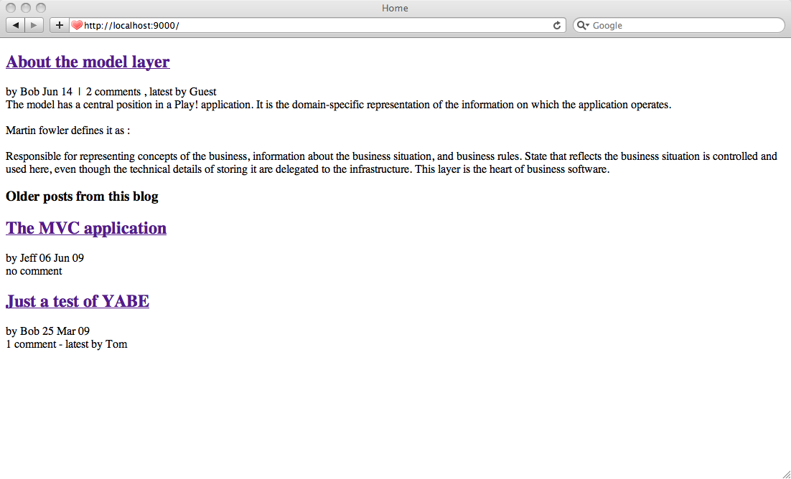
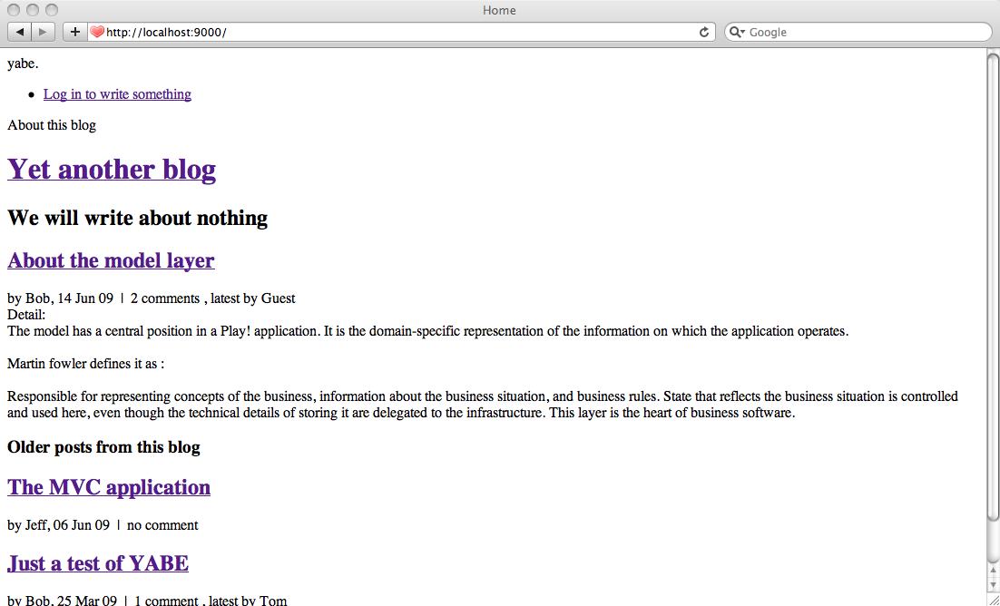

# 建立第一个页面

既然我们完成了数据模型的初步定义，是时候开始创建应用的页面了。这个页面将仅仅展示最近的博文，以及一个旧文章的列表。

下面是我们想要实现的目标的草图：

## 用默认数据启动

事实上，在开始编写第一个页面之前，我们还有一件事要做。编写一个缺乏数据的Web应用是乏味的。你甚至不能测试正在做的事情。但因为我们还没完成编辑页面，所以不能发布新的文章作为测试。

有一个注入默认数据到博客中的方法是在应用加载时加载一个fixture文件。要想这么做，我们得创建一个启动（Bootstrap）任务。一个Play任务可以在任意HTTP请求之外执行，比如在应用启动时或者通过CRON，或在特定时间点执行。

让我们来创建`/yabe/app/Bootstrap.java`任务，通过`Fixtures`加载一堆数据：

    import play.*;
    import play.jobs.*;
    import play.test.*;
     
    import models.*;
     
    @OnApplicationStart
    public class Bootstrap extends Job {
     
        public void doJob() {
            // Check if the database is empty
            if(User.count() == 0) {
                Fixtures.loadModels("initial-data.yml");
            }
        }
     
    }
    
我们用`@OnApplicationStart`注解这个任务，告诉Play我们希望在应用启动时，同步执行该任务。

> 事实上该任务的启动时机取决于是在开发模式还是在生产模式。在开发模式，Play会等待第一个请求才开始。所以任务会在第一个请求时同步执行。这样，当任务失败，你将在浏览器中看到错误信息。在生产模式，任务会在应用启动时执行（就在运行`play run`的时候），如果出错，应用将无法启动。

你可以在`yabe/conf/`文件夹下创建一个`initial-data.yml`。你当然可以重用我们之前用过的`data.yml`文件。

现在用`play run`运行应用，并在浏览器打开http://localhost:9000/

## 主页面

终于，是时候编写主页了。

你还记得第一个页面是如何输出的么？首先路由文件指定`/`URL将调用`controllers.Application.index()`action方法。然后这个方法调用`render()`并执行`/yabe/app/views/Application/index.html`模板。

我们将保持这些组件，不过给它们添加新的代码来加载文章列表并展示。

打开`/yabe/app/views/Application/index.html`控制器，修改`index()`action来加载文章列表，就像这样：

    package controllers;
     
    import java.util.*;
     
    import play.*;
    import play.mvc.*;
     
    import models.*;
     
    public class Application extends Controller {
     
        public static void index() {
            Post frontPost = Post.find("order by postedAt desc").first();
            List<Post> olderPosts = Post.find(
                "order by postedAt desc"
            ).from(1).fetch(10);
            render(frontPost, olderPosts);
        }
     
    }
    
你可以看懂我们是怎样向`render`方法传递对象的吗？这将允许我们用同样的名字在模板中访问它们。在这个例子，变量`frontPage`和`olderPosts`将在模板中可用。

修改`/yabe/app/views/Application/index.html`来展示这些对象：

    #{extends 'main.html' /}
    #{set title:'Home' /}
     
    #{if frontPost}
        

            <h2 class="post-title">
                <a href="#">${frontPost.title}</a>
            </h2>
            

                by ${frontPost.author.fullname}
                ${frontPost.postedAt.format('MMM dd')}
                
                    &nbsp;|&nbsp; 
                    ${frontPost.comments.size() ?: 'no'} 
                    comment${frontPost.comments.size().pluralize()}
                    #{if frontPost.comments}
                        , latest by ${frontPost.comments[-1].author}
                    #{/if}
                
            

            

                ${frontPost.content.nl2br()}
            

        

        
        #{if olderPosts}
            
    
                <h3>Older posts from this blog</h3>
            
                #{list items:olderPosts, as:'oldPost'}
                    

                        <h2 class="post-title">
                            <a href="#">${oldPost.title}</a>
                        </h2>
                        

                            
                                by ${oldPost.author.fullname}
                            
                            
                                ${oldPost.postedAt.format('dd MMM yy')}
                            
                            

                                ${oldPost.comments.size() ?: 'no'} 
                                comment${oldPost.comments.size().pluralize()}
                                #{if oldPost.comments}
                                    - latest by ${oldPost.comments[-1].author}
                                #{/if}
                            

                        

                    

                #{/list}
            

            
        #{/if}
        
    #{/if}
     
    #{else}
        

            There is currently nothing to read here.
        

    #{/else}
    
你可以阅读模板是怎么工作的。简单地说，它允许你动态访问Java对象。在幕后我们使用Groovy的语法。大多数你看到的优雅的结构（比如`?:`运算符）就来自Groovy。但你并不需要为了写Play模板而学习Groovy。如果已经熟悉其他像JSP with JSTL的模板语言，你不会感到惘然无所适。

Ok，现在刷新博客的首页。

不是很美观，但是至少有内容了！

但是因为需要通过多种方式展示文章（全文，全文附评论，预告），现在我们不得不写了过于冗余的代码。我们应该创建一些类似函数的东西，这样就可以在不同的模板中调用它们了。这实际就是Play标签所做的事情！

要想创建一个标签，仅需创建新的`/yabe/app/views/tags/display.html`文件。一个标签只是另一个模板。它就像函数一样可以接受参数。`#{display /}`标签只有两个参数：用于展示的文章对象以及展示的模式（可以是全文，全文附评论，预告中的一种）

    *{ Display a post in one of these modes: 'full', 'home' or 'teaser' }*
     
    

        <h2 class="post-title">
            <a href="#">${_post.title}</a>
        </h2>
        

            by ${_post.author.fullname},
            ${_post.postedAt.format('dd MMM yy')}
            #{if _as != 'full'}
                
                    &nbsp;|&nbsp; ${_post.comments.size() ?: 'no'} 
                    comment${_post.comments.size().pluralize()}
                    #{if _post.comments}
                        , latest by ${_post.comments[-1].author}
                    #{/if}
                
            #{/if}
        

        #{if _as != 'teaser'}
            

                
Detail: 

                ${_post.content.nl2br()}
            

        #{/if}
    

     
    #{if _as == 'full'}
        

            <h3>
                ${_post.comments.size() ?: 'no'} 
                comment${_post.comments.size().pluralize()}
            </h3>
            
            #{list items:_post.comments, as:'comment'}
                

                    

                        by ${comment.author},
                        
                            ${comment.postedAt.format('dd MMM yy')}
                        
                    

                    

                        
Detail: 

                        ${comment.content.escape().nl2br()}
                    

                

            #{/list}
            
        

    #{/if}
    
现在我们可以将冗余代码替换成标签，重写主页：

    #{extends 'main.html' /}
    #{set title:'Home' /}
     
    #{if frontPost}
        
        #{display post:frontPost, as:'home' /}
        
        #{if olderPosts.size()}
        
            

                <h3>Older posts from this blog</h3>
            
                #{list items:olderPosts, as:'oldPost'}
                    #{display post:oldPost, as:'teaser' /}
                #{/list}
            

            
        #{/if}
        
    #{/if}
     
    #{else}
        

            There is currently nothing to read here.
        

    #{/else}

重载页面，检查是否一切安好。

## 改进布局

如你所见，`index.html`继承自`main.html`。因为我们需要给所有的博客页面提供通用的布局，包括博客标题和验证链接，我们需要修改这个文件。

编辑`/yabe/app/views/main.html`：

    <!DOCTYPE html >
    <html>
        <head>
            <title>#{get 'title' /}</title>		
            <meta http-equiv="Content-Type" content="text/html; charset=utf-8"/>
            <link rel="stylesheet" type="text/css" media="screen" 
                href="@{'/public/stylesheets/main.css'}" />
            <link rel="shortcut icon" type="image/png" 
                href="@{'/public/images/favicon.png'}" />
        </head>
        <body>
            
            

                

                    yabe.
                

                <ul id="tools">
                    <li>
                        <a href="#">Log in to write something</a>
                    </li>
                </ul>
                

                    About this blog
                    <h1><a href="#">${blogTitle}</a></h1>
                    <h2>${blogBaseline}</h2>
                

            

            
            

                #{doLayout /} 
            

            
            

                Yabe is a (not that) powerful blog engine built with the 
                <a href="http://www.playframework.org">Play framework</a>
                as a tutorial application.
            

            
        </body>
    </html>

刷新并检查结果。大体上能工作，除了`blogTitle`和`blogBaseLine`变量未能显示。这是因为我们还没把它们传递给`render(...)`调用。当然我们可以在`index` action的`render()`调用中加入它们。但因为`main.html`将被作为整个应用的主模板，我们不想每次都添加它们。

要让一个控制器（或者其子类）的每个action都执行同样的代码，有一个方式是定义`@Before`拦截器。

让我们给Application控制器添加`addDefaults()`方法：

    @Before
    static void addDefaults() {
        renderArgs.put("blogTitle", Play.configuration.getProperty("blog.title"));
        renderArgs.put("blogBaseline", Play.configuration.getProperty("blog.baseline"));
    }
    
> 你需要在`Application.java`中导入`play.Play`。

所有添加进`renderArgs`作用域的变量将可被模板访问。并且你可以看到这个方法从`Play.configuration`对象中读取变量的值。`Play.configuration`对象包括`/yabe/conf/application.conf`的所有配置键。

在配置文件中添加这两个键：

    # Blog engine configuration
    # ~~~~~
    blog.title=Yet another blog
    blog.baseline=We will write about nothing
    
刷新主页，检查现在能否正常展示。

## 加入样式

现在博客的主页已经基本完成，但不是很美观。我们需要添加一些样式来装扮它。如你所见，主模板`main.html`文件引入了`/public/stylesheets/main.css`。我们将往它里面添加更多样式。

从[这里](http://www.playframework.com/documentation/1.2.7/files/main.css)下载一份样式表，然后复制到`/public/stylesheets/main.css`。（译者注：最困难的部分就这样一笔带过了，这让我想到了[如何画一匹马](http://tieba.baidu.com/p/1391621903)）

刷新页面，你应该看到最终的完成稿了。

## 提交你的成果

博客主页已经完成。又到了提交修改的时候了：

    $ bzr st
    $ bzr add
    $ bzr commit -m "Home page"
    
