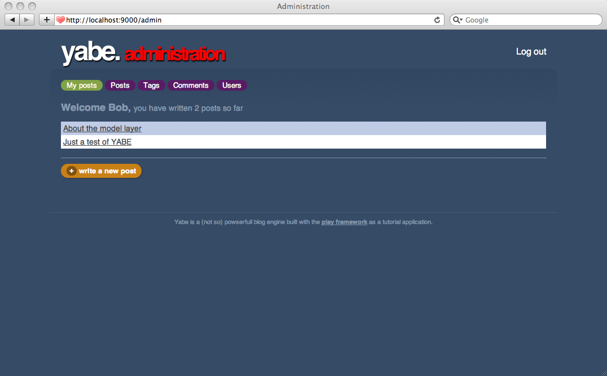
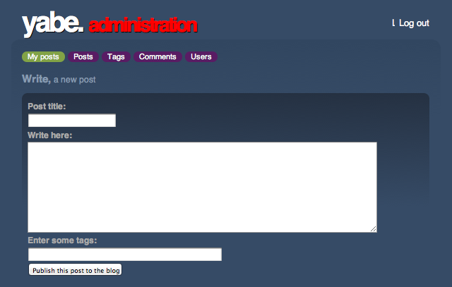

# 自定义编辑区域

在前一章，我们给yabe创建了一个关于面板，并准备了“我的文章”的部分。每个作者可以在这个部分看到他们发布过的文章，以及进行编辑或者创建新的文章。

我们可以重用CRUD模块来实现这部分。但是这里我们打算从头开始，因为我们需要许多自定义的设置。

## 从文章列表开始

我们仅需要查询用户相关的文章并显示出来。这很简单。从改进`Admin.index` action开始吧：

    public static void index() {
        String user = Security.connected();
        List<Post> posts = Post.find("author.email", user).fetch();
        render(posts);
    }
    
并完成`yabe/app/views/Admin/index.html`:

    #{extends 'admin.html' /}
     
    <h3>Welcome ${user}, you have written ${posts.size() ?: 'no'} 
    ${posts.pluralize('post', 'posts')} so far</h3>
     
    #{list items:posts, as:'post'}
        

            <a href="#">${post.title}</a>
        

    #{/list}
     
    

        <a href="#">+ write a new post</a>
    

    
看看第一步的成果：

## 发布文章界面

我们将创建一个用于发布文章的界面。一般对于一个表单，你可以做两件事：显示它，处理它提交的结果。让我们创建`Admin.form'和`Admin.save`来帮助显示和处理提交结果。

添加新的路由到`yabe/conf/routes`:

    GET     /admin/new                          Admin.form
    POST    /admin/new                          Admin.save
    
接着给`Admin.java`控制器添加`form()`和`save()`：

    public static void form() {
        render();
    }
     
    public static void save() {
        // Not implemented yet
    }

然后是创建`yabe/app/views/Admin/form.html`模板：

    #{extends 'admin.html' /}
     
    <h3>Write, a new post</h3>
     
    #{form @save()}
     
        #{ifErrors}
            

                Please correct these errors.
            

        #{/ifErrors}
         
        

            #{field 'title'}
            <label>Post title:</label>
            <input type="text" name="${field.name}" 
                value="${post?.title}" />
            #{error 'post.title' /}
            #{/field}
        

     
        

            #{field 'content'}
            <label>Write here:</label>
            <textarea name="${field.name}">${post?.content}</textarea>
            #{error 'post.content' /}
            #{/field}
        

     
        

            #{field 'tags'}
            <label>Enter some tags:</label>
            <input type="text" size="50" 
                name="${field.name}" value="${post?.tags?.join(' ')}" />
            #{/field}
        

        
        

            <input type="submit" value="Publish this post to the blog" />
        

        
    #{/form}
    
最后修改`yabe/app/views/Admin/index.html`，给表单添加**Write a new post**的链接：

    ...
    

        <a href="@{form()}">+ write a new post</a>
    

    ...

检查成果：

现在我们来完成处理提交结果的。它将创建一个新的`Post`对象，转换标签列表成真正的`Tag`列表，并验证所有成员，进行保存。如果发生错误，它会刷新表单，显示错误信息。

    public static void save(String title, String content, String tags) {
        // Create post
        User author = User.find("byEmail", Security.connected()).first();
        Post post = new Post(author, title, content);
        // Set tags list
        for(String tag : tags.split("\\s+")) {
            if(tag.trim().length() > 0) {
                post.tags.add(Tag.findOrCreateByName(tag));
            }
        }
        // Validate
        validation.valid(post);
        if(validation.hasErrors()) {
            render("@form", post);
        }
        // Save
        post.save();
        index();
    }
    
> 这里我们使用`render("@form")`作为`render("Admin/form.html")`的缩写。它表示使用form action的默认模板。

测试一下！

## 重用发布文章的代码

在发布文章的地方，我们已经写了不少的HTML表单和Java action代码。但我们还需要实现编辑现有文章的修改功能。只需改动一下，我们可以重用原来的代码。

首先我们需要`Admin.form`可以查询到一个现有的`Post`：

    public static void form(Long id) {
        if(id != null) {
            Post post = Post.findById(id);
            render(post);
        }
        render();
    }

如你所见，我们把查询功能变成可选的，仅当`id`参数不为空，才会去查询一个现有文章。所以你可以链接主页面的文章列表到编辑表单。修改`yabe/app/views/Admin/index.html`：

    #{extends 'admin.html' /}
     
    <h3>Welcome ${user}, you have written ${posts.size() ?: 'no'} ${posts.pluralize('post', 'posts')} so far</h3>
     
    #{list items:posts, as:'post'}
        

            <a href="@{Admin.form(post.id)}">${post.title}</a>
        

    #{/list}
     
    

    	<a href="@{form()}">+ write a new post</a>
    

    
非常简单，但是有一个问题。如果你查看这些链接生成的URL，会看到：

    /admin/new?id=3
    
它能用，但是不是很好。我们可以指定另一个路由。如果指定了`id`参数，就用新的路由。

    GET     /admin/myPosts/{id}                 Admin.form
    GET     /admin/new                          Admin.form

如你所见，我们在旧的路由之上定义新路由，所以它的优先级更高。这意味着，如果提交了`id`参数，Play将选择这条路由。如果不是，它就选择原来那条。

刷新**My posts**页面，你应该能看到URL的变化。

现在我们需要修改`yabe/app/views/Admin/form.html`：

    #{extends 'admin.html' /}
     
    #{ifnot post?.id}
        <h3>Write, a new post</h3>
    #{/ifnot}
    #{else}
        <h3>Edit, this post</h3>
    #{/else}
     
    #{form @save(post?.id)}
     
        #{ifErrors}
            

                Please correct these errors.
            

        #{/ifErrors}
         
        

            #{field 'title'}
            <label>Post title:</label>
            <input type="text" name="${field.name}" 
                value="${post?.title}" />
            #{error 'post.title' /}
            #{/field}
        

     
        

            #{field 'content'}
            <label>Write here:</label>
            <textarea name="${field.name}">
              ${post?.content}
            </textarea>
            #{error 'post.title' /}
            #{/field}
        

     
        

            #{field 'tags'}
            <label>Enter some tags:</label>
            <input type="text" size="50" 
                name="${field.name}" value="${post?.tags?.join(' ')}" />
            #{/field}
        

        
        

            <input type="submit" value="Publish this post to the blog" />
        

        
    #{/form}

如你所见，如果`id`参数存在，我们将用它作为提交表单的第一个参数。所以假如这个文章具有id的值（意味着它已经存在在系统中），`Admin.save`就会被调用。

现在我们改变`save()`方法，让它同时能处理创建和修改文章的情况：

    public static void save(Long id, String title, String content, String tags) {
        Post post;
        if(id == null) {
            // Create post
            User author = User.find("byEmail", Security.connected()).first();
            post = new Post(author, title, content);
        } else {
            // Retrieve post
            post = Post.findById(id);
            // Edit
            post.title = title;
            post.content = content;
            post.tags.clear();
        }
        // Set tags list
        for(String tag : tags.split("\\s+")) {
            if(tag.trim().length() > 0) {
                post.tags.add(Tag.findOrCreateByName(tag));
            }
        }
        // Validate
        validation.valid(post);
        if(validation.hasErrors()) {
            render("@form", post);
        }
        // Save
        post.save();
        index();
    }
    
一如之前那样，我们需要定义多一个更合适的路由，还是用之前的方式：
    
    POST    /admin/myPosts/{id}                 Admin.save
    POST    /admin/new                          Admin.save
        
完成了！现在我们可以用同一个方法来创建新的文章，或者修改旧的文章，而且管理面板也完成了！