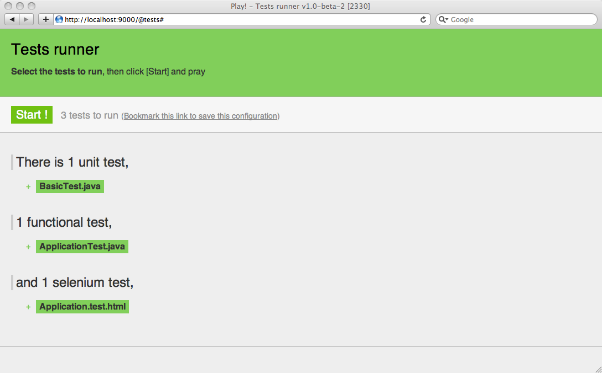

# 数据模型的首次迭代

接下来我们要开始完成我们的博客引擎的模型部分。

## JPA入门

模型层是一个Play应用的核心（对于其他Web框架也同样成立）。它是一个对应用操作的资源的领域特定的表示。因为我们想要创建一个博客引擎，模型层就包括User，Post和Comment（用户，博文和评论）。

因为大多数模型对象需要在应用停止运行时保留下来，我们需要把它们存储在持久性数据库中。一个普遍的选择是使用关系型数据库。因为Java是一个面向对象的语言，我们将使用一个[ORM](http://zh.wikipedia.org/wiki/%E5%AF%B9%E8%B1%A1%E5%85%B3%E7%B3%BB%E6%98%A0%E5%B0%84)来减少一些繁琐的工作。

[JPA](http://baike.baidu.com/view/1036852.htm)是一个给ORM定义一套标准API的Java规范。作为一个JPA的实现，Play使用猿媛皆知的[Hibernate](http://www.hibernate.org/)框架。之所以使用JPA而不是原生的Hibernate API，是因为这样所有的映射都可以用Java对象直接完成。

如果之前用过Hibernate或JPA，你将惊讶于Play所添加的包装。不再需要配置什么了；JPA与Play框架合一。

如果你不知道JPA，你可以在继续之前阅读[一些JPA实现的介绍](http://docs.oracle.com/javaee/6/tutorial/doc/bnbpz.html)

# User类

我们首先来完成User类。创建新文件`/yabe/app/models/User.java`，并写入下面的内容：

    package models;
 
    import java.util.*;
    import javax.persistence.*;
     
    import play.db.jpa.*;
     
    @Entity
    public class User extends Model {
     
        public String email;
        public String password;
        public String fullname;
        public boolean isAdmin;
        
        public User(String email, String password, String fullname) {
            this.email = email;
            this.password = password;
            this.fullname = fullname;
        }
     
    }
    
`@Entity`注解（annotation）标记该类成为托管的JPA实体（managed JPA Entity），而Model父类将自动提供一些接下来将会用到的有用的JPA辅助函数。这个类的所有成员变量都会被持久化到数据库中。

> 默认情况下，对应的表就是'User'。如果想要使用一个'user'是保留关键字的数据库，你需要给JPA映射指定一个不同的表名。要想这么做，使用`@Table(name="blog_user")`注解`User`类。

> 你的模型对象不一定得继承自`play.db.jpa.Model`类。你也可以使用原生JPA。但继承自该类往往是个更好的选择，因为它使得运用JPA变得更为简单。

如果之前用过JPA，你知道每个JPA实体都需要提供一个@Id属性。在这里，Model父类已经提供了一个自动生成的ID，在大多数情况下，这样就行了。

> 不要认为生成的**id**成员变量是函数变量（functional identifier），其实它是技术变量（technical identifier）。区分这两概念通常是个好主意，记住自动生成的ID是一个技术变量（译注：这里我弄不懂，以下附上原文）

> Don’t think about this provided **id** field as a functional identifier but as a technical identifier. It is generally a good idea to keep both concepts separated and to keep an automatically generated numeric ID as a technical identifier.

如果你写过Java，心中可能已经敲起了警钟，因为我们居然大量使用公有成员！在Java（一如其他面向对象语言），最佳实践通常是尽量保持各成员私有，并提供getter和setter。这就是封装，面向对象设计的基本概念之一。事实上，Play已经考虑到这一点，在自动生成getter和setter的同时保持封装；等下我们将看到它是怎么做到的。

现在你可以刷新主页面，看一下结果。当然，除非你犯错，否则应该什么变化都看不到:D。Play自动编译并加载了User类，不过这没有给应用添加任何新特性。

## 写下第一个测试

测试新增的User类的一个好方法是写下JUnit测试用例。它会允许你增量开发的同时保证一切安好。

要运行一个测试用例，你需要在'test'模式下运行应用。停止当前正在运行的应用，打开命令行并输入：

~$ play test

`play test`命令就像`play run`，不过它加载的是一个测试运行器模块，使得你可以直接在浏览器中运行测试套件。

> 当你在`test mode`中运行Play应用时，Play会自动切换到`test`框架ID并加载对应的`application.conf`。阅读[框架ID文档](http://www.playframework.com/documentation/1.2.7/ids)来了解更多。

在浏览器打开http://localhost:9000/@tests页面来看看测试运行器。尝试选择所有的默认测试并运行；应该全部都会是绿色……但是默认的测试其实什么都没测:D

我们将使用JUnit测试来测试模型部分。如你所见，已经存在一个默认的`BasicTests.java`，所以让我们打开它（`/yabe/test/BasicTest.java`）：

    import org.junit.*;
    import play.test.*;
    import models.*;
     
    public class BasicTest extends UnitTest {
     
        @Test
        public void aVeryImportantThingToTest() {
            assertEquals(2, 1 + 1);
        }
     
    }
    
删除没用的默认测试（`aVeryImportantThingToTest`），创建一个注册新用户并进行检查的测试：

    @Test
    public void createAndRetrieveUser() {
        // Create a new user and save it
        new User("bob@gmail.com", "secret", "Bob").save();
        
        // Retrieve the user with e-mail address bob@gmail.com
        User bob = User.find("byEmail", "bob@gmail.com").first();
        
        // Test 
        assertNotNull(bob);
        assertEquals("Bob", bob.fullname);
    }
    
如你所见，Model父类给我们提供了两个非常有用的方法：`save()`和`find()`。

> 你可以在Play文档中的[JPA支持](http://www.playframework.com/documentation/1.2.7/jpa)阅读到Model类的更多方法。

在test runner中选择`BasicTests.java`，点击开始，看一下是不是全都变绿了。

我们将需要在User类中添加一个方法，来检查给用户的用户名和密码是否存在了。让我们完成它，并且测试它。

在`User.java`中，添加`connect()`方法：

    public static User connect(String email, String password) {
        return find("byEmailAndPassword", email, password).first();
    }
    
如今测试用例成这样：

    @Test
    public void tryConnectAsUser() {
        // Create a new user and save it
        new User("bob@gmail.com", "secret", "Bob").save();
        
        // Test 
        assertNotNull(User.connect("bob@gmail.com", "secret"));
        assertNull(User.connect("bob@gmail.com", "badpassword"));
        assertNull(User.connect("tom@gmail.com", "secret"));
    }
    
每次修改之后，你都可以从Play测试运行器运行所有的测试，来确保没有什么被破坏了。

## Post类

