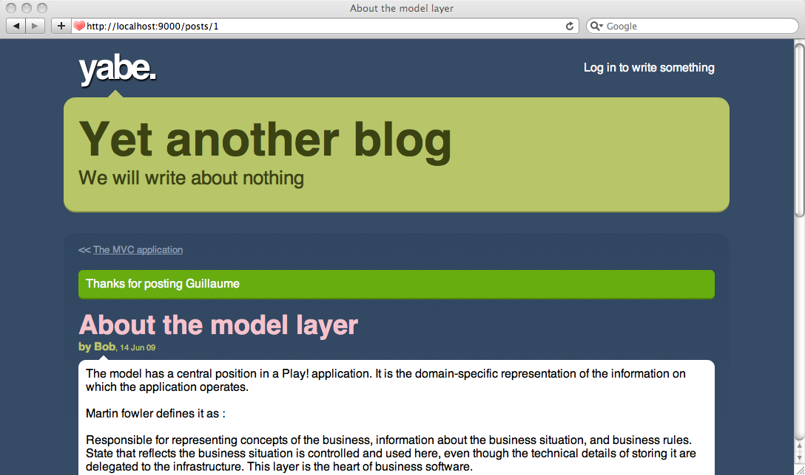

# 浏览和提交评论

博客主页现在已经完成，接下来要完成博客正文页面。整个页面将展示当前文章的所有评论，还包括一个用于提交新的评论的表单。

## 创建'show' action

要显示文章内容，我们需要在`Application`控制器添加新的action。就叫它`show()`：

    public static void show(Long id) {
        Post post = Post.findById(id);
        render(post);
    }

如你所见，整个action简明扼要。我们接受一个id参数作为Long类型Java对象。而这个参数可以来自于URL路径或HTTP请求正文。

> 如果接收到的id参数不是有效的数字，`id`的值会是`null`，而Play会在`errors`容器中新增一个验证错误。

这个action会显示`/yabe/app/views/Application/show.html`模板：

    #{extends 'main.html' /}
    #{set title:post.title /}
     
    #{display post:post, as:'full' /}
    
因为之前写好了`display`标签，写这个页面就变得简单。

## 给正文页面添加链接

在display标签中，我们让所有的链接保持为空（使用`#`）。是时候让这些链接指向`Application.show` action。在Play模板中，你可以简单地用`@{...}`记号来创建链接。这个语法使用路由来“转换”URL成对应的action。

修改`/yabe/app/views/tags/display.html`标签：

    …
    <h2 class="post-title">
        <a href="@{Application.show(_post.id)}">${_post.title}</a>
    </h2>
    …
    
现在刷新主页，点击一个标题来展示正文。

呃……好像缺了个返回主页面的链接。修改`/yabe/app/views/main.html`模板来完成标题链接：

    …
    

        About this blog
        <h1><a href="@{Application.index()}">${blogTitle}</a></h1>
        <h2>${blogBaseline}</h2>
    

    …

现在终于可以在主页和正文之间切换了。

## 指定一个更语义化的URL

如你所见，正文页面的URL是：

    /application/show?id=1
   
这是因为Play的默认路由规则就是这样：

    *       /{controller}/{action}                  {controller}.{action}
    
通过指定`Application.show` action的路径，我们可以使用更语义化的URL。修改`/yabe/conf/routes`并在第一个路由下面添加新的路由：

    GET     /posts/{id}                             Application.show
    
> 这里`id`参数将从URL路径提取。你可以从[Route File Syntax](http://www.playframework.com/documentation/1.2.7/routes#syntax)中阅读更多关于URI模式的内容。

刷新浏览器，检查这次是否使用了正确的URL。

## 添加分页

要允许用户在文章间方便地流连忘返，我们需要添加分页机制。我们将拓展Post类来按需获取上一篇和下一篇文章：

    public Post previous() {
        return Post.find("postedAt < ? order by postedAt desc", postedAt).first();
    }
     
    public Post next() {
        return Post.find("postedAt > ? order by postedAt asc", postedAt).first();
    }
    
这个方法在每次请求时都会被多次调用，所以可以优化它们，不过现在先搁置。同时，在`show.html`模板顶部（在`#{display/}`标签前）添加分页链接：

    <ul id="pagination">
        #{if post.previous()}
            <li id="previous">
                <a href="@{Application.show(post.previous().id)}">
                    ${post.previous().title}
                </a>
            </li>
        #{/if}
        #{if post.next()}
            <li id="next">
                <a href="@{Application.show(post.next().id)}">
                    ${post.next().title}
                </a>
            </li>
        #{/if}
    </ul>
    
现在是不是更棒了？

## 添加评论表单

是时候开始完成评论表单。先从在Application控制器中增加`postComment` action方法开始。

    public static void postComment(Long postId, String author, String content) {
        Post post = Post.findById(postId);
        post.addComment(author, content);
        show(postId);
    }

如你所见，我们只是重用了之前添加给Post类的`addComment()`。

给`show.html`模板添加HTML表单（在`#{display /}`后面）：

    <h3>Post a comment</h3>
     
    #{form @Application.postComment(post.id)}
        

            <label for="author">Your name: </label>
            <input type="text" name="author" id="author" />
        

        

            <label for="content">Your message: </label>
            <textarea name="content" id="content"></textarea>
        

        

            <input type="submit" value="Submit your comment" />
        

    #{/form}
    
试下提交新的评论。它应该能工作。

## 添加验证

目前我们没有在创建评论之前验证表单内容。我们需要验证表单中包括Comment类构造函数中的每个参数。有了Play的验证机制，添加验证只是小菜一碟。修改`postComment` action来加入`@Required`验证注解，并检查有没有错误产生：

    public static void postComment(Long postId, @Required String author, @Required String content) {
        Post post = Post.findById(postId);
        if (validation.hasErrors()) {
            render("Application/show.html", post);
        }
        post.addComment(author, content);
        show(postId);
    }
    
> 也不要忘了引入`play.data/validation.*`

如你所见，如果发生验证错误，我们重新输出正文页面。我们需要修改表单代码来显示错误信息：

    <h3>Post a comment</h3>
     
    #{form @Application.postComment(post.id)}
     
        #{ifErrors}
            

                All fields are required!
            

        #{/ifErrors}
     
        

            <label for="author">Your name: </label>
            <input type="text" name="author" id="author" value="${params.author}" />
        

        

            <label for="content">Your message: </label>
            <textarea name="content" id="content">${params.content}</textarea>
        

        

            <input type="submit" value="Submit your comment" />
        

    #{/form}

注意到我们重用已经提交的参数来填充HTML input元素的值。

为了让博客的用户体验更优，我们将添加一点Javascript来自动聚焦到发生错误的地方。首先，需要[JQuery](http://www.playframework.com/documentation/1.2.7/files/jquery-1.4.2.min.js)和[JQuery Tools Expose](http://cdn.jquerytools.org/1.2.5/full/jquery.tools.min.js)，你得把它们引入进来。下载这两个库到`yabe/public/javascripts/`文件夹，并修改`main.html`模板来引入它们：

    …
        
        
    </head>
    
> 注意当前版本的Play内置的JQuery要比教程用到的新。

现在你可以在`show.html`模板底部添加这段代码：

    
    

现在评论框看起来真的美极了。我们还有加多两样东西。

首先，我们将在评论成功提交之后显示一个成功信息。为此，我们需要使用flash作用域来允许我们从一个action调用传递信息到下一个action。

修改`postComment`来添加成功信息：

    public static void postComment(Long postId, @Required String author, @Required String content) {
        Post post = Post.findById(postId);
        if(validation.hasErrors()) {
            render("Application/show.html", post);
        }
        post.addComment(author, content);
        flash.success("Thanks for posting %s", author);
        show(postId);
    }
    
并在`show.html`顶部添加可能显示成功信息的位置：

    …
    #{if flash.success}
        
${flash.success}

    #{/if}
     
    #{display post:post, as:'full' /}
    …

最后我们将修改`postComment` action所用的URL。因为我们没有给它指定路由，现在它用的是默认的路由。所以在应用的路由文件中添加下面一行：

    POST    /posts/{postId}/comments                Application.postComment
    
终于完成了。记得把改动提交到bazaar。
