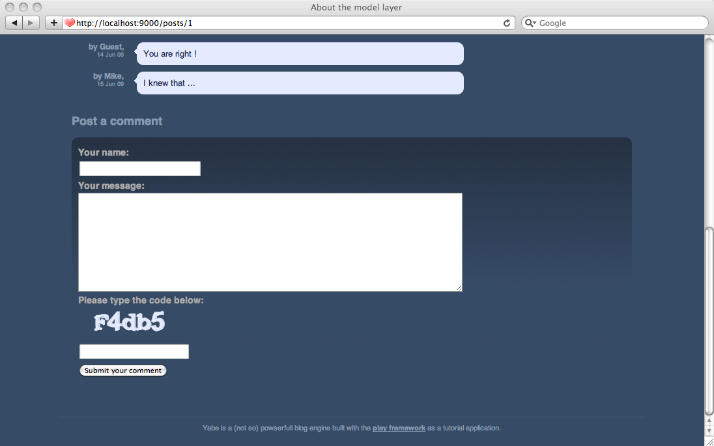

# 设置验证码

任何人都可以在我们的博客下发布评论，所以我们需要避免非人类用户来扰乱秩序。一个简单的防范方法是设置验证码。

# 生成验证码

我们先从如何简单地利用Play来生成验证码。简单来说，我们需要增加一个action，不过让它返回的是一个二进制的对象而不是之前的HTML页面。

因为Play是一个全栈式框架，我们试图在框架内部内置了Web应用通常所需的东西；其中就包括生成验证码。我们可以使用`play.libs.Images`来简单地生成验证码，然后通过HTTP响应返回它。

如常，我们先从一个原型开始。在`Applicantion`控制器中添加`captcha` action。

    public static void captcha() {
        Images.Captcha captcha = Images.captcha();
        renderBinary(captcha);
    }

注意我们可以直接传递captcha对象给`renderBinary()`，因为Images.Captcha类实现了`java.io.InputStream`。

> **请勿忘记**导入`play.lib.*`

现在在/yabe/conf/routes添加新路由：

    GET     /captcha                                Application.captcha
    
然后打开http://localhost:9000/captcha看看效果。

每次刷新时应该会产生随机的文字

## 我们怎样管理状态？

目前为止事情顺利，但是最复杂的部分就要来了。要想验证验证码，我们需要保存验证码图片上的文字，然后跟提交的表单进行比对。

当然我们可以把文字存储在用户会话中，然后在验证时再提取出来。但这样做有两个问题：

**首先**，Play的会话是存储在cookie里的。这样解决了一些架构上的问题，但是也引入一些麻烦。写入到cookie的数据是签了名的，这样用户就不能修改它；但是它并未加密。如果我们把验证码的内容写入cookie，每个人都可以读到它 —— 然后破解它。

**其次**，不要忘了Play是一个**无状态**的框架。我们想要在无状态的情况下管理事务。假如一个用户同时打开两个不同的博客页面，生成了不同的验证码，我们就需要跟踪处理对应的验证码。

所以要想解决问题，我们需要两样东西。我们得在服务器存储验证码的密钥。因为它是一个临时数据，我们可以存储在Play**缓存（Cache）**中。此外，这样做还可以增加安全性，因为存储在缓存中的数据的生命期是有限的（比如10分钟）。然后我们还需要生成**独一无二的ID**。这个ID将添加到每个表单的隐藏域中，对应着一个生成的验证码。

下面让我们来解决这个问题吧。

修改`captcha` action成这样：

    public static void captcha(String id) {
        Images.Captcha captcha = Images.captcha();
        String code = captcha.getText("#E4EAFD");
        Cache.set(id, code, "10mn");
        renderBinary(captcha);
    }
    
注意`getText()`方法接受任意颜色作为参数。它需要输入的颜色来画文本。

> **请勿忘记**导入`play.cache.*`。

## 添加验证码到评论框

现在，在显示一个评论框之前我们先生成一个独一无二的ID。然后我们修改HTML表单来显示验证码，并把ID写入隐藏的域里面。

让我们重写`Application.show` action:

    public static void show(Long id) {
        Post post = Post.findById(id);
        String randomID = Codec.UUID();
        render(post, randomID);
    }

以及`/yable/app/views/Application/show.html`模板中的表单：

    …
    

        <label for="content">Your message: </label>
        <textarea name="content" id="content">${params.content}</textarea>
    

    

        <label for="code">Please type the code below: </label>
        
         
        <input type="text" name="code" id="code" size="18" value="" />
        <input type="hidden" name="randomID" value="${randomID}" />
    

    

        <input type="submit" value="Submit your comment" />
    

    …
    
好棒，现在评论框里能看到验证码了。

## 验证验证码
