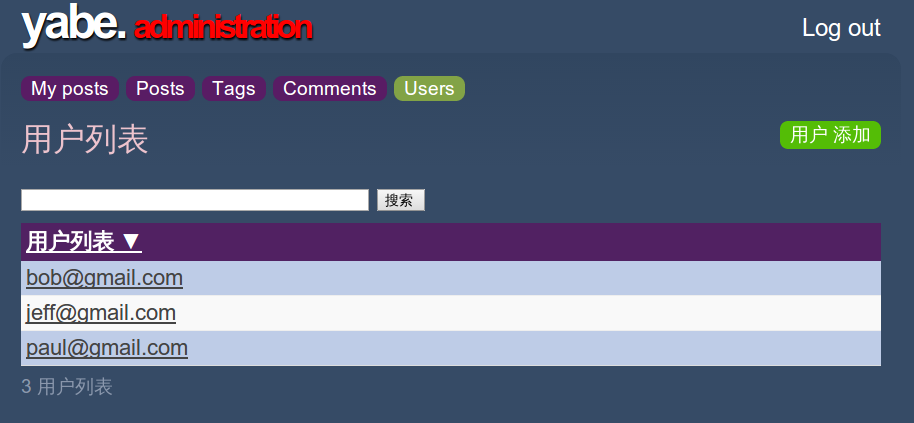

# 国际化和本地化

完成了博客引擎后，我们来考虑额外的一件事：Web应用的国际化和语言的本地化。虽然我们可以一开始就做这件事，但是最好还是先完成该应用的单一语言版本，然后再添加其他语言的支持。

## 国际化和本地化

我们将分两步讨论，先是[国际化](http://zh.wikipedia.org/wiki/%E5%9B%BD%E9%99%85%E5%8C%96%E4%B8%8E%E6%9C%AC%E5%9C%B0%E5%8C%96)，再是[本地化](http://en.wikipedia.org/wiki/Language_localisation)。这两样都会被重点提及。

国际化，在编程领域中，指的是移除本地特定的代码。在Web应用中，基本上是修改模板中特定于语言的交互文本。它还包括修改非文本的数据类型：日期，货币和其他数字。

本地化，是打造应用的本地版本。如果应用已经国际化了，就意味着存在一个或多个可选的本地版本。在Web应用中，本地化主要是把交互文本翻译成特定的语言。这里的“特定语言”，取决于浏览器和应用自己的设置。

实际上，两者是同步进行的：你在国际化的同时，往往也是在本地化。

## YABE

> 我们此次的起点，是在Play安装包的`samples-and-tests/yabe`中的已完成版本。目标是彻底国际化应用，然后添加简体中文的本地版本。（我擅自修改了教程的内容 ：D ）

现在开始吧。首先打开`conf/application.conf`，去除注释或添加一行来支持两种语言：

    # 为英文，简体中文本地化
    application.langs=en,zh_CN

如果你现在启动应用，Play命令行会显示两个Warning，因为你还没准备好本地信息文件：

    16:19:04,728 WARN ~ Messages file missing for locale en 
    16:19:04,729 WARN ~ Messages file missing for locale zh_CN
    
## UTF-8 信息文件

前面的警告提醒我们需要把现有的`conf/messages`文件替换成每个语言对应一个信息文件：

    messages.en
    messages.zh_CN
    
在这里，我们遇到跟一般在Java中的做法不一样的地方。这些文件用的语法跟Java properties文件一样，但它们不是properties文件，因为它们需要使用UTF-8编码。而Java properties文件使用的是Latin-1编码。

使用UTF-8进行编码能够给本地化带来很多的好处。这使得你可以用纯文本记录下本地化信息。比如，这意味着对于希腊本地化文本，原本需要：

    hello.morning = \u0152\u222b\u0152\u00b1\u0152\u00aa\u0152\u2211\u0152\u00ba\u0152\u2260\u0153\u00c5\u0152\u00b1
    hello.informal = \u0152\u2265\u0152\u00b5\u0152\u03c0\u0152\u00b1 \u0153\u00c9\u0152\u00f8\u0153\u00d6
    
现在只需直接使用希腊字母：

    hello.morning = καλημέρα 
    hello.informal = γεια σου
    
在本教程剩余部分，我们会在上述文件中定义信息，或在HTML模板中使用国际化标记。

## 简单的信息

最简单的情况是HTML模板中被包含起来的一条文本字符串。举个例子，在`yabe/app/views/main.html`模板内的`tools`列表中：

    <ul id="tools"> 
    <li> 
    <a href="@{Admin.index()}">Log in to write something</a> 
    </li> 
    </ul>
    
仅需使用`&{'key'}`语法，把该文本替换成待查找的信息，就能实现国际化：

    <ul id="tools"> 
    <li> 
    <a href="@{Admin.index()}">&{'views.main.tools.login'}</a> 
    </li> 
    </ul>

添加对应的行到每个信息文件，就能实现本地化。在`conf/messages.en`：

    views.main.tools.login = Log in to write something
    
在`conf/messages.zh_CN`：

    views.main.tools.login = 写点什么
    
具体的内容由你来定；在这个例子中，我使用了一个键来标记位置`views/main.html#tools`

一旦保存了更改，刷新一下，应该可以看到原本的英文文本变成中文了。这是因为请求中设定了`Accept-Language`为`zh-CN`的缘故。

## 应用模型的本地化

如果登录进博客的'admin'页面，你就能看到文章，标签，评论和用户的列表。这些页面是**CRUD**模块的功劳。对于每个页面，标题和列表头是与应用的模型，比如JavaBean类和属性名，联系在一起的。

我们可以使用这些模型的名字作为信息键，来国际化CRUD模块。就跟前面做的一样：

在`conf/messages.zh_CN`

    post = 文章  
    Post = 文章
    posts = 文章列表
    Posts = 文章列表  
    comment = 评论
    Comment = 评论
    comments = 评论列表
    Comments = 评论列表
    user = 用户
    User = 用户
    users = 用户列表
    Users = 用户列表
    
你将注意到那些圆角的紫色导航链接没有改变：

它们是在`views/admin.html`中定义的，通过用`&{'...'}`把文本包围起来，你就能把它们国际化：

    <a href="@{Posts.list()}">&{'Posts'}</a> 
    … 
    <a href="@{Tags.list()}">&{'Tags'}</a> 
    … 
    <a href="@{Comments.list()}">&{'Comments'}</a> 
    … 
    <a href="@{Users.list()}">&{'Users'}</a>
    
## 带参数的信息

除了字面量字符串，我们的应用还包括带有变量的信息，比如*posts tagged with `Play`*。

对于带单个参数的字符串，用[Java格式化字符串](http://docs.oracle.com/javase/7/docs/api/java/util/Formatter.html)来插入参数：

    views.Application.listTagged.title = Posts tagged with %s
    
接着在模板中，添加这样的参数：

    &{'views.Application.listTagged.title', tag}
    
当一个信息包括多个参数时，在格式化字符串中添加索引来指定参数顺序：

    views.Admin.index.welcome = Welcome %1$s, you have written %2$s posts so far
    
……然后就是这样：

    &{'views.Admin.index.welcome', user, posts.size()}
    
在这个例子中，我们想要使用“post”的正确的复数形式，所以也把这个词当做一个参数：

    views.Admin.index.welcome = Welcome %1$s, you have written %2$s %3$s so far
    
然后在模板中使用`pluralize`拓展：

    &{'views.Admin.index.welcome', user, posts.size(), posts.pluralize(messages.get('post'), messages.get('posts'))} 

注意我们需要使用`messages.get`来查找对应的单数和复数形式。

## 对模型层的本地化

对Play模型的本地化就跟对其他地方的本地化一样。这个应用使用到了CRUD和Secure模块，意味着我们需要本地化`play/modules/crud/conf/messages`和`play/modules/secure/conf/messages`中的用到的信息。

在`conf/messages.zh_CN`:

    # play/modules/crud (administration) 
    crud.title = 管理面板
    crud.home = 主页
    crud.blank = 新增功能 
    crud.index.title = 选择编辑对象
    crud.index.objectType = 输入对象
    crud.index.action = 
    crud.index.add = 添加
    crud.add = &{%s} 添加 
    crud.list.title = &{%s} 
    crud.list.size = %d &{%s} 
    crud.list.totalSize = %d 总计 
    crud.pagination.previous = « 上一页 
    crud.pagination.next = 下一页 » 
    crud.pagination.last = 末页 »» 
    crud.pagination.first = «« 首页 
    crud.show.title = &{%s} 编辑 
    crud.save = 保存 
    crud.saveAndContinue = 保存并继续编辑
    crud.cancel = 取消 
    crud.hasErrors = 请更正错误 
    crud.blank.title = &{%s} 添加
    crud.saveAndAddAnother = 保存并新增
    crud.delete = &{%s} 删除 
    crud.created = &{%s} 已创建
    crud.saved = &{%s} 已保存
    crud.deleted = &{%s} 已删除 
    crud.delete.error = 此对象无法删除 
    crud.search = 搜索 
    crud.none = (无) 
    crud.help.required = 必填
    crud.help.minlength = 至少要有 %d. 
    crud.help.maxlength = 最多只能是 %d. 
    crud.help.email = 需要有效邮箱
    crud.help.dateformat =  时间格式 YYYY-MM-DD
    crud.help.numeric = 需要数值类型 
    crud.help.min =  至少需要 %d 
    crud.help.future = 在将来 
    crud.help.past = 在之前 
    crud.help.after = 之上 %s. 
    crud.help.before = 之下 %s. 
    crud.help.range = 从 %d 到 %d 
     
    # play/modules/secure 
    secure.username = 您的邮箱: 
    secure.password = 您的密码: 
    secure.signin =  马上登录
    
## 特殊情况

当你在本地化一个Web应用时，假如你正在使用一个基于组件的Web应用框架，比如[JavaServer Faces](http://zh.wikipedia.org/wiki/JavaServer_Faces)，难免会遇到一些难以下手的地方：

1. 在属性的值中用到了参数信息
2. 格式化字符串中的信息
3. 用作信息的链接

在Play里，这三点都不是问题。

第一种情况，你在模板的属性的值里用到了参数信息，比如：

    <a href="@{Application.show(_post.id)}" title="By Bob">
    
这是JSF的一个问题，因为通常需要使用XML标签来完成参数替换，而不能直接在属性值里完成。在Play中，你可以直接这么写：

    <a href="@{Application.show(_post.id)}" title="&{'views.tags.display.author', _post.author.fullname}"> 
    
第二种情况是在想要使用格式化字符串来排版一个值，比如用参数拼出`By Bob on 2009-06-14`这样的日期格式。这又是由于使用XML标签来格式化所导致的问题。本来如果能使用一个XML属性的值来排版，就能解决这个问题。在Play中，由于传递信息参数的语法不一样，你不会遇到这样的问题。你可以：

    &{'views.tags.display.author', _post.author.fullname, comment.postedAt.format('yyyy-MM-dd')}"} 
    
你也可以这样写：

    &{'views.tags.display.author', _post.author.fullname, comment.postedAt.format(messages.get('views.dateFormat'))}"}
    
第三种情况发生在你想把一个特定信息作为超链接的时候。在JSF，这是一个问题。因为超链接是一个JSF组件，意味着它的标记不能放在信息文件中。Play，正好相反，允许你在模板中使用原生HTML，所以你可以把用于URL的参数直接放入带信息的标记中：

    logIn = <a href="%s">Log in</a> to write something
    
    &{'logIn', '/admin'} 

我们应用就曾用`<a href="@{Admin.index()}">`这样的语法会让框架生成基于路由文件的URL。要想在本地化的过程中处理它，使用：

    &{'logIn'}, actionBridge.Admin.index()}
    
## 最终成果

来看下我们给“Yet Another Blog Engine”进行本地化（汉化）的最终结果。

其实没有汉化完全，对吧……(╯▽╰)
